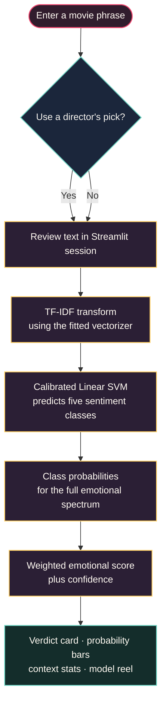

<div align="center">

# ReelFeel

### Movie review sentiment analysis, presented like a midnight screening.

[](https://www.python.org/)
[](https://streamlit.io/)
[](https://scikit-learn.org/)
[](https://altair-viz.github.io/)
[](https://jupyter.org/)
[](#limitations)

<br />


<br />

**Turn a movie phrase into a five-point emotional reading.**

[Launch the repository](https://github.com/Samarssj/movie-review-sentiment-analysis) · [Explore the notebook](notebooks/Sentiment_Analysis_Movie_Reviews.ipynb) · [Run locally](#quick-start)

</div>

---

## The idea

ReelFeel classifies a movie review phrase across an ordinal five-point sentiment scale: **Negative**, **Somewhat Negative**, **Neutral**, **Somewhat Positive**, and **Positive**. The model is trained on the Kaggle *Sentiment Analysis on Movie Reviews* dataset, which contains phrase-level Rotten Tomatoes review excerpts [1].

The project combines a reproducible classical machine-learning workflow with a cinematic Streamlit interface. The app does not stop at a label: it shows the complete probability distribution, a weighted emotional score, confidence, phrase-length context, model comparisons, and the composition of the training corpus.

> **A small screening room for language, tone, and the stories we tell about stories.**

## What is inside

| Experience | What it does |
| --- | --- |
| **Analyze a review** | Enter a custom phrase or load one of five director’s picks, then receive a calibrated sentiment prediction. |
| **Emotional spectrum** | See how probability is distributed across all five sentiment classes instead of relying on a single hard label. |
| **Model reel** | Compare validation accuracy and training time across Naive Bayes, Logistic Regression, Linear SVM, tuned Linear SVM, and Random Forest. |
| **Training-set lens** | Explore the sentiment-class composition of the 156,060 labeled training phrases. |
| **Behind the curtain** | Read the pipeline, assumptions, and limitations directly inside the app. |

## The cinematic interface

The Streamlit app uses a cinema-inspired visual system: a near-black theater backdrop, warm marquee gold, coral and teal signal colors, serif display typography, film-strip details, and glassy result cards.

<p align="center">
  
</p>

<p align="center">
  
</p>

## Technology stack

| Python | Streamlit | Pandas | NumPy | scikit-learn | Altair | Jupyter |
| --- | --- | --- | --- | --- | --- | --- |
| [](https://www.python.org/) | [](https://streamlit.io/) | [](https://pandas.pydata.org/) | [](https://numpy.org/) | [](https://scikit-learn.org/) | [](https://altair-viz.github.io/) | [](https://jupyter.org/) |

| Layer | Tools | Role in the project |
| --- | --- | --- |
| **Language** | Python | Data preparation, model training, inference, and application logic. |
| **Data & analysis** | Pandas, NumPy, Jupyter | Dataset inspection, feature analysis, evaluation, and reproducible experiments. |
| **Machine learning** | scikit-learn | TF-IDF feature extraction, model comparison, tuning, calibration, and inference. |
| **Interface** | Streamlit | Interactive review input, session state, layout, metrics, and tabbed experience [2]. |
| **Visualization** | Altair | Probability bars, model accuracy, training-time comparison, and corpus distribution charts [3]. |
| **Version control** | Git, GitHub | Source history, collaboration, and reproducible project delivery. |

## Architecture

The project separates exploration and training from the lightweight inference experience. The notebook produces serialized artifacts; the Streamlit app loads those artifacts once, caches them, and focuses on fast prediction and explanation.

```mermaid
flowchart LR
    %% ReelFeel architecture
    classDef source fill:#1b263b,stroke:#70d6c5,color:#f7f4ef,stroke-width:1.5px;
    classDef process fill:#2b1f35,stroke:#ffd166,color:#fffaf2,stroke-width:1.5px;
    classDef artifact fill:#311d2d,stroke:#ef476f,color:#fffaf2,stroke-width:1.5px;
    classDef output fill:#142d2b,stroke:#70d6c5,color:#fffaf2,stroke-width:1.5px;

    subgraph DATA["Data & exploration"]
        TSV["Rotten Tomatoes<br/>train.tsv / test.tsv"]:::source
        NB["Jupyter notebook<br/>EDA · training · evaluation"]:::process
        TSV --> NB
    end

    subgraph ML["Classical ML pipeline"]
        TFIDF["TF-IDF vectorizer<br/>20K unigram + bigram features"]:::process
        MODELS["Model comparison<br/>NB · Logistic Regression · SVM · RF"]:::process
        TUNED["Tuned Linear SVM<br/>calibrated probabilities"]:::process
        NB --> TFIDF --> MODELS --> TUNED
    end

    subgraph ARTIFACTS["Versioned artifacts"]
        VEC["vectorizer.pkl"]:::artifact
        MODEL["model.pkl"]:::artifact
        RESULTS["classical_results.json"]:::artifact
        TUNED --> VEC
        TUNED --> MODEL
        MODELS --> RESULTS
    end

    subgraph APP["ReelFeel Streamlit app"]
        UI["Cinematic review interface"]:::process
        LOAD["Load cached artifacts"]:::process
        PREDICT["Transform phrase → predict"]:::process
        CHARTS["Probability bars · model reel<br/>training distribution"]:::output
        UI --> LOAD --> PREDICT --> CHARTS
    end

    VEC --> LOAD
    MODEL --> LOAD
    RESULTS --> LOAD
    PREDICT -->|"sentiment + confidence"| UI
```



The editable diagram source lives at [`docs/architecture.mmd`](docs/architecture.mmd).

## Prediction flow

A review phrase travels through the same fitted vectorizer and calibrated model used during training. The final interface makes both the prediction and its uncertainty visible.



The editable flow source lives at [`docs/prediction-flow.mmd`](docs/prediction-flow.mmd).

## Model results

The comparison notebook evaluates classical models on identical TF-IDF features and a held-out validation split. The tuned, calibrated Linear SVM is the model used for live predictions.

| Model | Validation accuracy | Training time |
| --- | ---: | ---: |
| **Linear SVM (tuned, calibrated)** | **60.12%** | — |
| Linear SVM | 59.98% | 3.09 s |
| Logistic Regression | 59.49% | 8.42 s |
| Naive Bayes | 57.37% | 0.02 s |
| Random Forest | 51.09% | 155.84 s |

These values are read from [`app/classical_results.json`](app/classical_results.json), so the README table and in-app Model reel can be updated together when the experiment changes.

## Repository map

```text
movie-review-sentiment-analysis/
├── app/
│   ├── app.py                    # Cinematic Streamlit interface
│   ├── model.pkl                 # Calibrated Linear SVM artifact
│   ├── vectorizer.pkl            # Fitted TF-IDF vectorizer
│   ├── classical_results.json    # Model comparison metrics
│   └── requirements.txt          # App dependencies
├── data/
│   ├── sampleSubmission.csv      # Kaggle submission template
│   └── submission.csv            # Generated predictions
├── docs/
│   ├── architecture.mmd          # Editable architecture diagram
│   └── prediction-flow.mmd       # Editable inference-flow diagram
├── notebooks/
│   └── Sentiment_Analysis_Movie_Reviews.ipynb
├── requirements.txt              # Notebook dependencies
└── README.md
```

## Quick start

### 1. Clone the repository

```bash
git clone https://github.com/Samarssj/movie-review-sentiment-analysis.git
cd movie-review-sentiment-analysis
```

### 2. Install the app dependencies

```bash
python -m venv .venv
source .venv/bin/activate        # Windows: .venv\Scripts\activate
python -m pip install --upgrade pip
python -m pip install -r app/requirements.txt
```

### 3. Launch ReelFeel

```bash
streamlit run app/app.py
```

Then open the local URL printed by Streamlit, typically `http://localhost:8501`.

### 4. Explore the notebook

For the complete EDA, feature engineering, training, model comparison, and error analysis workflow:

```bash
python -m pip install -r requirements.txt
jupyter notebook notebooks/Sentiment_Analysis_Movie_Reviews.ipynb
```

## Reproducing the pipeline

The notebook follows a compact, repeatable sequence:

1. Load and inspect the Rotten Tomatoes phrase dataset.
2. Analyze sentiment balance and phrase-length behavior.
3. Fit TF-IDF features using unigrams and bigrams.
4. Train and compare Naive Bayes, Logistic Regression, Linear SVM, tuned Linear SVM, and Random Forest.
5. Select the strongest classical model and calibrate it for class probabilities.
6. Serialize the model, vectorizer, and comparison metrics for the Streamlit app.
7. Generate predictions for the provided test phrases.

## Sentiment scale

| Class | Meaning | App color |
| --- | --- | --- |
| **0 · Negative** | Strongly critical or unfavorable language | `#EF476F` |
| **1 · Somewhat Negative** | Mildly critical or disappointed language | `#F78C6B` |
| **2 · Neutral** | Mixed, factual, or emotionally balanced language | `#B7B7C9` |
| **3 · Somewhat Positive** | Mild approval or favorable language | `#70D6C5` |
| **4 · Positive** | Strongly favorable or enthusiastic language | `#FFD166` |

## Limitations

The model was trained on short Rotten Tomatoes phrases, not full-length reviews. Predictions on longer, more nuanced, ironic, or context-dependent writing may differ from human judgment. Because the sentiment classes are ordinal and adjacent labels are semantically close, the model can reasonably confuse neutral with somewhat positive or somewhat negative language. Class imbalance in the source data can also pull ambiguous phrases toward the middle of the scale.

This is an educational research demo, not a production moderation, recommendation, or decision-making system.

## References

[1]: https://www.kaggle.com/c/sentiment-analysis-on-movie-reviews "Kaggle — Sentiment Analysis on Movie Reviews"
[2]: https://docs.streamlit.io/ "Streamlit documentation"
[3]: https://altair-viz.github.io/ "Altair documentation"
[4]: https://scikit-learn.org/stable/ "scikit-learn documentation"
[5]: https://github.com/badges/shields "Shields.io badge documentation"

<p align="center">
  <sub>Built for the love of language, cinema, and interpretable machine learning.</sub>
</p>
